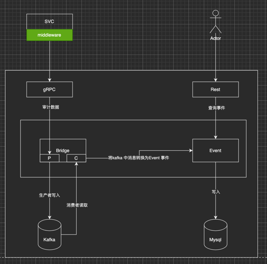

# maudit
微服务审计中心


### 架构说明

- 用户引入 maudit 包，会自动将Producer 中间件加载到 go-restful 框架
- 当请求到达时，Producer 会抓取相关数据写入到 Kafka 中
- Maudit 中的 Consumer 消费 Kafka 中的数据，并写入到 Mysql 数据库中
- 用户可通过 Maudit 提供的 API 查询审计数据


### 使用方式
```go
import _ "github.com/qiaogy91/maudit/client"
```